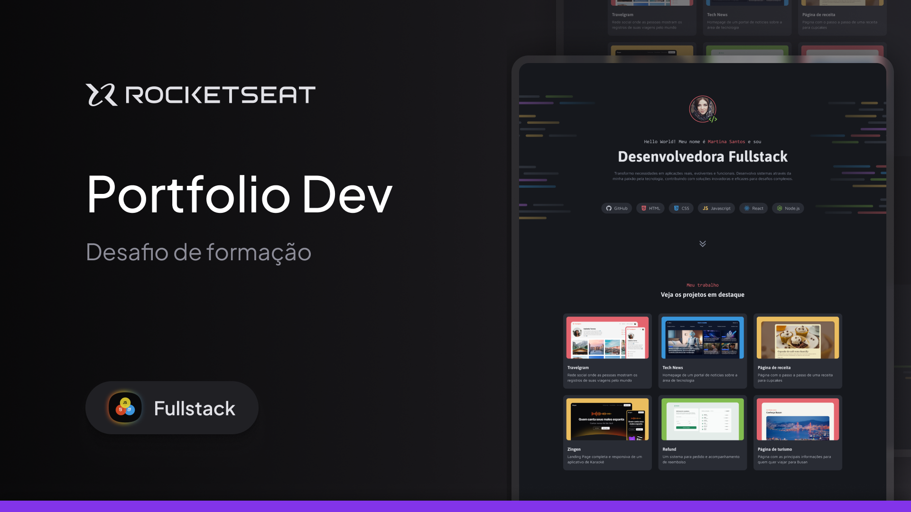

# Desafio prático - Portfólio Dev

<picture>
  <source media="(prefers-color-scheme: dark)" srcset="assets/images/Thumbnail-md.png">
  <source media="(prefers-color-scheme: light)" srcset="assets/images/Thumbnail-md.png">
  
</picture>

### Conceitos trabalhados nessa aplicação:

|Conceitos                              |                   |
|---------------------------------------|-------------------|
|  ✔ Criação de layouts com CSS         | ✔ CSS Flexbox               |
|  ✔ Posicionamento de elementos        | ✔ CSS Grid               |
|  ✔ Variáveis CSS                      | ✔ pseudo-class e pseudo-elements |

